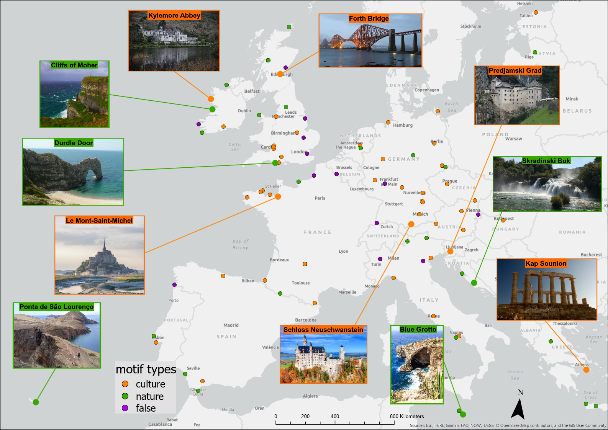
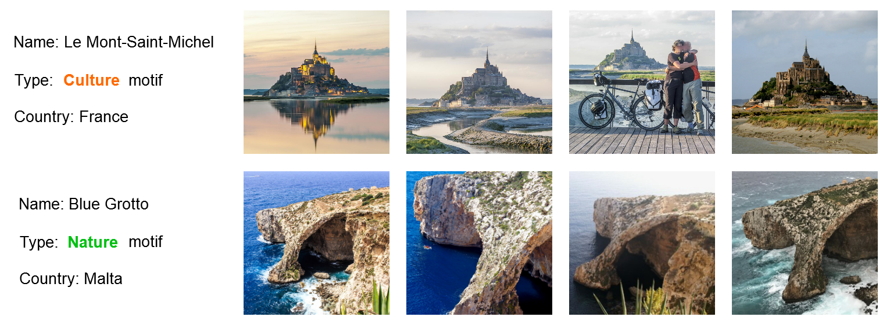
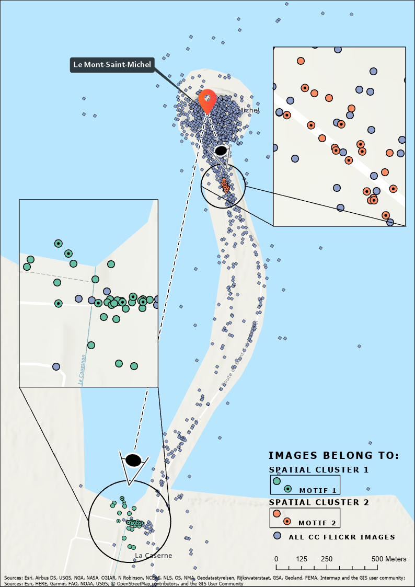

# Motif Detection

Published in Journal of Outdoor Recreation and Tourism titled:

"Automated motif identification: Analysing Flickr images to identify popular viewpoints in Europe’s protected areas"

https://doi.org/10.1016/j.jort.2021.100479

## Introduction

Visiting landscapes and appreciating them from specific viewpoints is not a new phenomenon. Such so-called motifs were popularised by travel guides and art in the romantic era, and find their contemporary digital twins through images captured in social media. We developed and implemented a conceptual model of motifs, based around spatial clustering, image similarity and the appreciation of a motif by multiple individuals. We identified 119 motifs across Europe, using 2’146’176 georeferenced Creative Commons Flickr images found in Natura 2000 designated areas. About 65\% of motifs contain cultural elements such as castles or bridges. The remaining 35\% are natural features, and biased towards coastal elements such as cliffs. Characterisation and localisation of motifs could allow identification of locations subject to increased pressure, and thus disturbance, especially since the visual characteristics of motifs allow managers to explore why sites are being visited. Future work will include methods of calculating image similarity using tags, explore different algorithms for assessing content similarity and study the behaviour of motifs through time.
## Setup
This pipeline uses spatial clustering ([HDBSCAN](https://joss.theoj.org/papers/10.21105/joss.00205)) and computer vision image analysis ([SIFT](https://www.cs.ubc.ca/~lowe/papers/ijcv04.pdf)) to detect motifs in images.

1. Initialise all required python packages by using the `requirements.txt` file to create an identical, compatible anaconda environment with the following command: 
`conda create --name myenv --file requirements.txt`

1.1 Additionally, the GitHub repo 'FlickrFrame' (from main author) is required if one plans to query the FlickrAPI: 
`git clone https://github.com/Bellador/FlickrFrame.git` and change line 13 in `main.py` to the path were FlickrFrame was cloned to locally.

2. Adjust the core parameters of main.py regarding:
  - All path parameters for API keys & secrets, database login, storage etc. Search for: 'URL here' and enter the required paths manually
  - Project description
  - SIFT configuration
  - HDBSCAN configuration
  - Motif filtering settings (normally set to None to allow dynamic filtering on the entire output with `geomap_filter_for_motifsize.py`) 
  - data source (FlickrAPI, external (Postgresql) database, local directory with .csv data files)

3. Adjust `db_querier.py` which handles database handling and querying if a database shall be used as data storage for the pipeline

4. Run `main.py`

## Output

For each new project a designated directory will be created which stores all the output produced by the pipeline. This output includes:

  - .csv file containing original FlickrAPI data (if FlickrAPI was selected as data source)

  - downloaded Flickr images (if FlickrAPI was selected as data source)

  - Folder named 'cluster_html_inspect' which holds html-files for each HDBSCAN cluster and the therein identified motifs. The filenames include the motif score which is a measure for motif quality as well as the used filter parameters. These filter parameters are also listed in the header of the html file itself along with the actual visual motif output.

  - Folder named 'dataframe_pickles' which holds the entire pipeline calculation output for each HDBSCAN cluster. The data-frame encompasses all photo_ids of the contained images, their image similarity score matrix and their final motif cluster label. This data can used in subsequent processing steps to further filter and plot results!

## Further data processing

We added a script called `geomap_filter.py` to the repo which makes further processing of the created data-frame pickle output easy. The script allows to filter all HDBSCAN clusters for motifs with a given minimum size as well as a minimum amount of unique authors. Additionally, it outputs a .CSV file containing the motifs that meet the filter requirements together among others with the motifs mean coordinates. This enables convenient visualisation and plotting in any GIS.

## Processed Results
The following results were based on an individually updated version of the original Yahoo Flickr Creative Commons 100 Million Database ([YFCC100m](https://multimediacommons.wordpress.com/yfcc100m-core-dataset/)). The research area was set exclusively to the [Nature 2000 protected areas](https://ec.europa.eu/environment/nature/natura2000/index_en.htm) of Europe.

The map shows the spatial distribution and occurrence of the motifs by our processing pipeline in the Natura 2000 protected areas. In total 119 motifs were identified of which 68 are cultural motifs, 36 natural motifs and 15 false positive motifs. All displayed motifs contain a minimum of five images by a minimum of five unique authors. The data foundation for this map is the updated Yahoo Flickr Creative Commons 100 Million dataset. For visualisation purposes a subsample of the 119 motifs is displayed with an image while indicating their motif type in colour.

*Image sources:  (place name, flickr username, flickr image id, user license)*

*Le Mont-Saint-Michel: Pepe Martınez Camara - 15286893754 - [CC BY-NC-SA 2.0]*

*Durdle Door:  KC2000 - 3620585132 - [CC BY-NC-ND 2.0]*

*Cliffs of Moher:  gnu1742 - 6580681781 - [CC BY-NC-SA 2.0]*

*Kylemore Abbey:  Johnny Graber - 15730653587 - [CC BY-NC-SA 2.0]*

*Forth Bridge:  bryan...  - 26331288697 - [CC BY-SA 2.0]*

*Predjamski Grad:  Tom - 14889396090 - [CC BY-ND 2.0]*

*Skradinski Buk:  Igor Gushchin - 37953928496 - [CC BY 2.0]*

*Kap Sounion:  Marc - 4835837372 - [CC BY-NC-ND 2.0]*

*Blue Grotto:  Michael Holler - 19879729385 - [CC BY-NC 2.0]*

*Schloss Neuschwanstein:  Jiuguang Wang - 5134934131 - [CC BY-SA 2.0]*

*Ponta de S ̃ao Louren ̧co:  ERREACHE - 48587252767 - [CC BY-NC-ND 2.0]*

----------------

Visual examples of an identified culture and nature motif

*Image sources:  (place name, flickr username, flickr image id, user license)*

*Le Mont-Saint-Michel*

*1. Pepe Martínez Cámara - 15286893684 - [CC BY-NC-SA 2.0]*

*2. Pablo Garbarino - 15381699077 - [CC BY-NC-ND 2.0]*

*3. marottef - 8845388500 - [CC BY-NC 2.0]*

*4. Paolo Ramponi - 12415418924 - [CC BY-NC-SA 2.0]*

*Blue Grotto*

*1. Michael Holler - 19879729385 - [CC BY-NC 2.0]*

*2. Joris Gruber - 25475401601 - [CC BY-NC-ND 2.0]*

*3. Sin Amigos - 2963000725 - [CC BY 2.0]*

*4. Chris Jagers - 32406808006 - [CC BY-NC-ND 2.0]*

----------------

  

We identified two motifs of Le Mont-Saint-Michel based on Creative Commons Flickr images with a minimum of five unique authors and motif images. The figure illustrates the spatial distribution and proportion between the input data, the formed spatial clusters and the resulting motifs.

### Cite

Maximilian C. Hartmann, Olga Koblet, Manuel F. Baer, Ross S. Purves,
Automated motif identification: Analysing Flickr images to identify popular viewpoints in Europe’s protected areas,
Journal of Outdoor Recreation and Tourism,
Volume 37,
2022,
100479,
ISSN 2213-0780,
https://doi.org/10.1016/j.jort.2021.100479.
(https://www.sciencedirect.com/science/article/pii/S2213078021001158)

Abstract: Visiting landscapes and appreciating them from specific viewpoints is not a new phenomenon. Such so-called motifs were popularised by travel guides and art in the romantic era, and find their contemporary digital twins through images captured in social media. We developed and implemented a conceptual model of motifs, based around spatial clustering, image similarity and the appreciation of a motif by multiple individuals. We identified 119 motifs across Europe, using 2146176 georeferenced Creative Commons Flickr images found in Natura 2000 protected areas. About 65% of motifs contain cultural elements such as castles or bridges. The remaining 35% are natural features, and biased towards coastal elements such as cliffs. Characterisation and localisation of motifs could allow identification of locations subject to increased pressure, and thus disturbance, especially since the visual characteristics of motifs allow managers to explore why sites are being visited. Future work will include methods of calculating image similarity using tags, explore different algorithms for assessing content similarity and study the behaviour of motifs through time.
Keywords: Landscape perception; User-generated content; Computer vision; Image similarity; Places of interest; Social media
